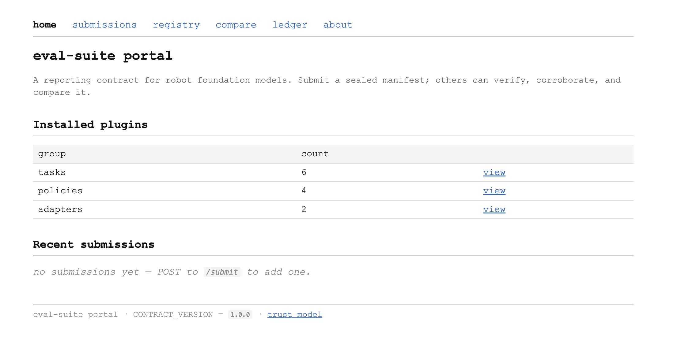
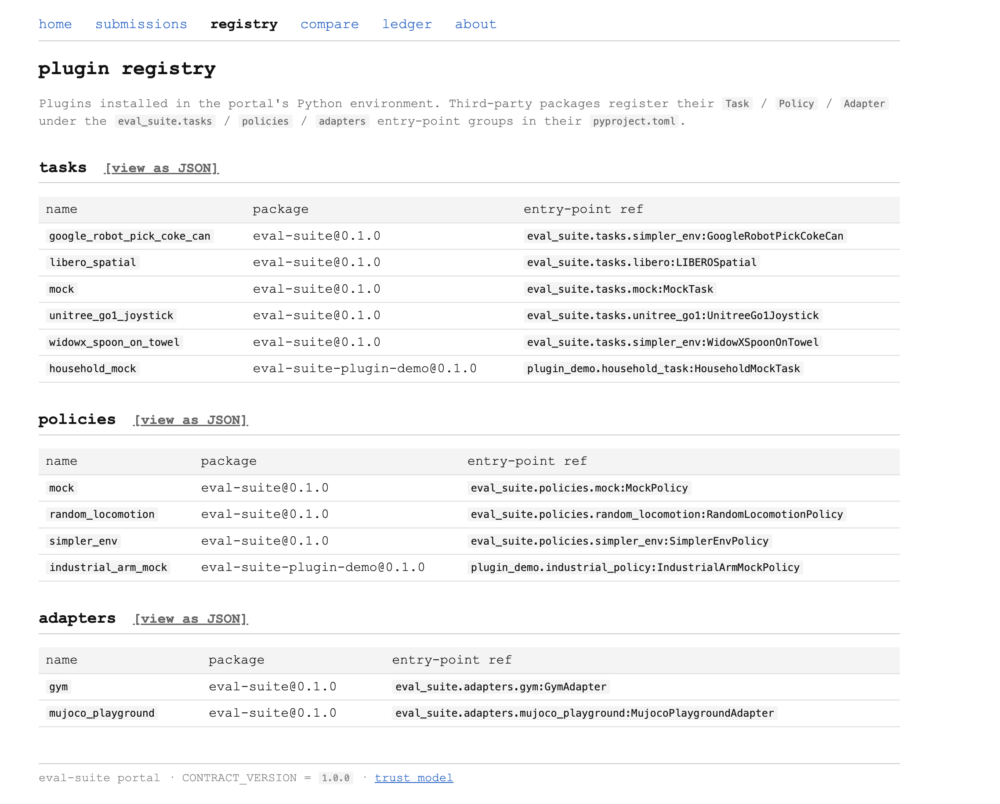

# Extension Document

## 1. Philosophy & Scope

Scoring well on an eval is not the end goal for any group serious about deployment. The question is always whether a model can help robots complete real-world tasks; the eval suite's value is in helping developers get to that point and helping stakeholders verify performance before deployment. A good eval suite should mimic the real world such that scoring well on an eval directly correlates to real-world performance.

With that in mind, there are multiple use cases worth designing for when creating an eval suite. Three of the most important are:

- **Developers** need specific feedback on where their model can be improved.
- **Researchers** need shared, reproducible, and reliable numbers to compare methods across papers and push the field forward.
- **Customers** need statistics about whether model X will work in their conditions.

Based on this, building a general evaluation suite must effectively address each of these use cases in order to become the default within academia and industry. With this in mind, the philosophy behind the eval suite plan I've developed is as follows:

- **Developers.** The output of the eval suite is a vector across deployment-relevant axes, not a single number, with a defined ranking metric — the worst-axis minimum — that makes profiles directly comparable without flattening them. A model's headline rank is its weakest deployment-relevant dimension, not its average across conditions, which gives developers a clear target for improvement and resists the saturation that aggregate scores hit when frontier models cluster near the ceiling.
- **Researchers.** Every run produces a small receipt recording exactly which code, model, simulator, assets, seeds, and hardware were used, hashed for verifiability. Every per-condition success rate is reported with a Wilson 95% confidence interval, so a "60% success" number is never ambiguous about whether it came from 6/10 trials or 60/100. This means a number cited in one paper can be checked or built on by another without rerunning the original setup, and when two labs get different numbers, the receipts let them trace the difference to a specific component. This gives robotics a shared coordinate system for comparing methods — auditable, resistant to gaming, and inclusive of both open- and closed-weights submissions — replacing the current state where every paper produces its own untethered number against its own version of its own benchmark.
- **Customers.** Every result is shipped with a calibration tier indicating how well the sim number predicts real-world performance (from "validated against real-robot data" down to "sim-only, no real-world anchor"), paired with a per-axis breakdown of which deployment-relevant conditions were varied during testing. This means a deployer can answer the two questions that actually matter to them — is this number trustworthy enough to act on, and were the conditions tested the conditions that exist in their factory — instead of being handed a single aggregate and asked to trust it.

This suite is deliberately trying not to be the next benchmark added to an already saturated field. More specifically:

- **Not another aggregate-success-rate task family.** v0 doesn't ship new tasks — it runs on what SimplerEnv and LIBERO already provide. The contribution is the contract; the tasks are the substrate it happens to be implemented over. Shipping another aggregate benchmark wouldn't move the discriminative regime forward — frontier models already saturate the most-cited ones (LIBERO, SIMPLER, parts of RoboCasa), and the ones that aren't saturated (BEHAVIOR-1K) fail customers and the field on substrate portability, not on difficulty.
- **Not a sim-specific tool.** The architecture is sim-agnostic by design. SimplerEnv is the primary v0 backend because it ships working pretrained-VLA integrations and the full Variant Aggregation cell grid, but the contract — manifest schema, profile output, calibration tier, submission protocol — can absorb LIBERO, RoboCasa, ManiSkill3 native, Isaac Lab, MuJoCo Playground, or real-robot cells without changing shape (verified with LIBERO already running through the contract in v0). This architecture choice is critical for adoption: widespread reference status is much harder to achieve when you have to get people to switch tools.
- **Not a real-robot leaderboard.** Credibility comes from the calibration tier system, not from running a real robot in-house. As paired sim-real data accrues across the field — from hosted evaluation, from industrial deployment, from academic partnerships — sim numbers can be upgraded from sim-only into real-validated over time.

The throughline: the suite's job is to define the contract everyone reports against, not to be one more thing reported against. Tasks, simulators, real-robot cells, and submission paths plug in over time; the contract stays stable. The software structure is developed with the ease of plugging in new tasks, robots, and simulators as a first-order constraint.

The substrate-plugin separation is shipped as a real package boundary in v0: the repo distributes `eval-suite-core` (the contract, manifest, sweep driver, analysis, portal, conformance kit, calibration registry) and `eval-suite-stdlib` (the in-tree reference Tasks / Policies / Adapters) as two independent pip distributions sharing the `eval_suite.*` import namespace via PEP 420. Third-party plugins depend on `eval-suite-core` only — never on the bundled reference plugins. The in-tree plugins are structurally identical to a third-party plugin (`[project.entry-points."eval_suite.tasks"]` etc.); they're bundled because the contract has to be proven on something, not because they're privileged. `examples/external_plugin_demo/` is a sibling pip package that depends on `eval-suite-core` and registers through the same entry-point groups the in-tree code uses, which is the load-bearing demonstration that the architecture isn't pretending.

## 2. Coverage & Substrate

A contract serious about generality has to absorb three substrate axes without changing shape: simulator, embodiment, and model class. Each is addressed in turn; v0 already has working evidence for each, and the next 3 additions per axis are named with rationale.

- **Simulator.** v0 runs on SimplerEnv (ManiSkill2 real2sim branch) for its working Octo + RT-1 integrations and the full Variant Aggregation cell grid. The sim-agnosticism claim is verified, not aspirational: `eval_suite/tasks/libero.py` (~85 LOC) implements the same `Task` Protocol against LIBERO-Spatial, producing a sealed manifest, the same 13-column trials CSV, and h.264 mp4s through the same `run_sweep()` driver — zero edits to the sweep loop, manifest, analysis, statistics, notebook, or CI. v0 also absorbs MuJoCo Playground for the legged case as a sibling Adapter. Three backends, one contract. The next-3, in priority order: **ManiSkill3** (GPU-parallel sim, 10–15× faster — the v1 wide-sweep path, gated on Variant Aggregation porting), **Isaac Lab** (industrial adoption gravity + USD assets), **RoboCasa** (kitchen-scale task diversity; a saturating benchmark whose users gain from profile-shaped reporting). Each costs roughly the LIBERO addition's order of magnitude — one Task or sibling Adapter, a sim-specific gym shim if needed.

- **Asset interchange formats.** The contract interfaces with all three of USD, URDF, and MJCF because conversion between them is routinely possible today. Isaac Sim ships URDF→USD; MuJoCo's `compile` does URDF→MJCF; SAPIEN has a URDF importer; `urdf2mjcf` and `usd2urdf` exist as community tools. Conversion is lossy for edge cases (joint-type approximations, collision-mesh simplification) but works for typical robot models. The Adapter is the interchange; the Task wraps whatever format a sim natively uses. Picking a canonical format would force every potential adopter whose assets are in another format to convert before they can use the suite — which directly contradicts §6's zero-switching-cost adoption argument.

  v0 ships a working USD-to-MJCF demonstration of this against a real-world scan: a Poly Haven Namaqualand Boulder 05 photogrammetric scan (CC0) converts via `usd2mjcf` (LightwheelAI, Apache-2.0) plus a `trimesh` decimate-and-convex-hull collision step (the `coacd` path that `usd2mjcf --generate_collision` invokes produces 269 convex pieces for this single boulder vs. one 548-face hull, ~75× smaller), drops into the existing MuJoCo Playground Adapter as a `NamaqualandScanTask`, and produces a sealed manifest with the source-USD + converted-MJCF SHA256s recorded in a new `asset_provenance.json` sidecar — zero changes to `contracts.py`, `manifest.py`, `sweep.py`, or the canonical-axis taxonomy. The same pipeline shape ingests a Gaussian-splat-derived USD when the §3 splat prototype lands.

  

  *Full mp4 at `takehome/media/namaqualand_rollout.mp4`; reproduce with `MUJOCO_GL=egl .venv-mjx/bin/python examples/namaqualand_sweep.py --output-dir <dir> --trials 5`.*

- **Embodiment.** v0 ships two fixed-base arms (Google Robot, WidowX) and a legged quadruped (Unitree Go1 via MuJoCo Playground, 12-DoF joint-space) under `RandomLocomotionPolicy` as the substrate proof that the contract absorbs a different action class without contract changes. The cell catalog discriminates — random control survives on flat terrain, fails on rough terrain and under lateral perturbation — which is the property the contract is supposed to expose. A trained Go1 controller is the next thing to drop in. Next-3 embodiments: **humanoid** (1X, Figure, Optimus are the customer-facing frontier), **bimanual coordination** (factory dexterity; ALOHA's pipeline is the reference), **mobile manipulator** (Stretch, Spot-with-arm — the embodiment class bridging locomotion with manipulation).

- **Action-space unification.** The field's standard answer is OXE's 7-DoF EEF-delta canon. That canon doesn't survive the legged case — v0's `JointAction` is the evidence. The cleaner answer is per-class action types (`EEFAction`, `JointAction`, eventually `BimanualAction`, `WheelTwistAction`) that share a value-type Protocol but not a flattening rule. The eval suite's job is to expose action shape honestly, not flatten it.

- **Foundational-model coverage.** Model coverage matters not because the suite has architecture-specific opinions about VLAs vs world models vs diffusion policies, but because **if the eval only works for one category, it can't be the reference everyone uses — each lab is shipping a different category and nobody will switch off their preferred eval just to be measured.** The reference suite has to absorb whatever a lab actually trained.

  The way v0 handles this is by making the submission contract as small as possible: one Protocol with two methods, `Policy.reset(instruction)` and `Policy.step(observation)`. Most model classes fit this without any modification — a diffusion policy samples from a distribution inside `step`; a VLA generates an action token sequence inside `step`; a world model that does planning runs its rollouts and picks an action inside `step`. The model's internals don't matter to the contract.

  The one category that doesn't fit is **pure-prediction world models** like Cosmos or a raw V-JEPA 2 encoder — they don't output actions, so there's no `step` return value to score. Those need a separate `WorldModelTask` companion Protocol that scores prediction quality (video fidelity, physics consistency over a horizon) and projects the result onto the same canonical dimensions everything else uses. That's a v1.5 deliverable; v0 covers the action-outputting majority.

  The objection — "if you really claim sim-agnostic, why is v0 effectively single-sim for VLAs?" — has a clean answer. The contract has to be proven on the substrate where the most working integrations exist. LIBERO and MuJoCo Playground are the agnosticism evidence, run under MockPolicy and RandomLocomotionPolicy respectively. The claim is "the contract absorbs them," not "v0 produces published VLA numbers on them" — the latter is gated on per-sim venv hygiene (numpy<2 / SAPIEN vs JAX 0.10 / numpy>=2 vs robosuite 1.4 are mutually incompatible) and is v1 work.

## 3. Methodology & Statistics

Before getting into specifics, it's worth being clear about what this suite is right now and where it's headed. v0 is a **substrate**: it enables accurate reporting (Wilson CIs, signed manifests, content-addressed run_ids), easy mix-and-matching of tools (any Task + any Policy + any Adapter via the registry), and reliability (CI-enforced, 76 tests, byte-identical reproduction). It runs on existing benchmarks — SimplerEnv's Variant Aggregation grid, LIBERO-Spatial, MuJoCo Playground's joystick env — because that's the way to prove the contract without first having to invent tasks.

The eventual goal is bigger: the suite will **generate its own trials from 3D Gaussian splats**, so a task isn't a hardcoded scene a benchmark author shipped, but a parametric variation over splat-derived environments that can be expanded indefinitely. The ingestion substrate is already in place: v0 ships a USD-photogrammetric-scan demo end-to-end (Poly Haven Namaqualand boulder → MJCF → sweep → sealed manifest + asset-provenance sidecar; see §2 and `assets/namaqualand_scan/`), and the same pipeline shape consumes a splat-derived USD without further contract work. The splat-specific piece — parametric generation over splat-derived environments — is what v1 builds on top. Splat-derived trials close the loop with §6's adoption plan — once labs and partners contribute their own scanned environments, the trial library grows organically into something no single benchmark can match.

For v0 the axes and trials are concrete; the substrate is what makes both of those replaceable.

Axis design and trial budget are the same conversation. The cell grid defines what claim the suite is making; the trial count defines how tight that claim is. Splitting them lets either side smuggle in choices the other should be paying for — a paper can quietly cut trials from 30 to 10 without changing its grid and report the same headline, or expand axes without adding trials and call the resulting noise structure. The contract names cells as definitional and trials as a precision knob.

- **Axes — what they are and why.** v0 reports five axes on Google Robot pick-coke-can — orientation (3 levels), lighting (3), background (3), distractor (2), table texture (3). The reason these five: orientation and lighting are the two conditions every published VLA paper varies, so v0 numbers stay directly comparable to the SimplerEnv tables; background and table texture cover the visual-distribution shift that's the dominant failure mode for image-conditioned policies; distractor probes whether the model is attending to the right object instead of grabbing the nearest red thing. v0 also adds a paraphrase axis (5 cells including two cross-embodiment boundary cells: "walk forward to the can", "stand up and grab the can") populating the language canonical dim, and Go1's 12-cell joystick grid.

  Axis design is wrapped in a closed-enum canonical taxonomy: `CanonicalDim = Literal["language", "visuals", "physics", "embodiment"]`, the four shifts the takehome prompt names a generalist model is tested against. Each Task declares a `canonical_axis_map` projecting concrete axes onto the four dims. The enum is mypy-enforced; the mapping is signed into the manifest hashable payload (schema 0.2.0); a Task author who silently re-buckets axes changes the run_id, and the change is auditable. v1 adds pairwise-consistency CI (verify cells differing only on a visuals-mapped axis actually differ visually) plus held-out canonical cells.

- **LIBERO-PRO-style overfit.** This is the named risk for fixed-grid axes. The LIBERO-PRO paper (Wang et al., 2510.03827) is the receipts: models that score >90% on standard LIBERO collapse to ~0% under perturbations to object position, initial state, instruction phrasing, or environment, with Pi0.5 the only one breaking 0.38 on libero-goal under position perturbations. That's the failure mode this suite is designed to expose by construction — the profile shape catches it where an aggregate hides it. The mitigation against the same thing happening here has two parts: procedural perturbations within each level (camera pose jitter, table-height jitter, gripper-friction multiplier — v1 widens this menu), and held-out cell rotation — 30% of cells per release move into a held-out pool, profiles publish both, divergence between public-cell and held-out-cell rank is the gaming signal. Procedural and fixed test sets aren't competing strategies: procedural axes catch overfitting to specific parameters, fixed cells preserve cross-paper comparability. You want both.

- **Statistics.** Binary success per trial is reported with a Wilson 95% CI (z=1.959963984540054), implemented in `eval_suite/statistics.py`. Wilson is shorter than Agresti-Coull at extreme p (matters for boundary cells where success rates are near zero) and less conservative than Clopper-Pearson at small N (where the wedge claim lives). Cross-cell aggregate metrics are reported as IQM with stratified-bootstrap CIs.

  The headline ranking metric is **worst-axis minimum** — `min_axis(mean_over_levels(cell_success_rate))`. Mean ranking rewards the wrong model (70% everywhere over 95/85/90/30), median hides single bad axes, 75th-percentile-of-axes has no deployer interpretation. The known counter is level-count bias: axes with more levels have more chances to contain a bad one. v0 acknowledges this; v1 fixes it via deployment-relevance weighting — `Cell.axes` gains a `weight: float` from customer-deployment frequency, per-axis means become weighted averages, the ranking minimizes weighted-mean. A factory that never sees alt-background-2 stops penalizing models for failing it.

- **Trial count.** v0 uses N=20 per cell. To be honest about why: initial testing was done on a single RTX 3090, and at that hardware budget N=20 across the full grid is what fits in a wall-clock sweep that still leaves room to iterate on the rest of the system. The Wilson half-width at N=20 is ±15pp at extremes and ±22pp at p=0.5 — sized for shape discrimination, not per-cell significance. Model-vs-model claims are framed accordingly as shape comparisons: both RT-1 and Octo collapse on the paraphrase axis (RT-1 per-axis mean 0.270, Octo 0.070) — a 20pp gap on the shared worst axis that survives any plausible per-cell Wilson width. RT-1 is robust everywhere else (orientation 0.855, lighting 0.881, visuals axes near 0.886); Octo is not (worst non-language axis lighting at 0.191). A 5pp gap on a non-language axis between two models doesn't survive at N=20, and v0 doesn't claim it does. As the system scales — multi-GPU sweep parallelism plus the ManiSkill3 GPU-parallel sim branch — this will be fixed; v1 targets N=100 by default. Manifests record N per cell; an N=100 sweep drops in alongside N=20 results without code changes.

- **Reproducibility.** Every run emits a `manifest.json` content-addressed by SHA256 of the canonical-JSON payload minus `run_id`; `Manifest.verify()` recomputes and asserts byte-identity. Pinned inputs: code SHA, container digest, model checkpoint hash, SimplerEnv commit (06accac), ManiSkill2_real2sim commit (ef7a4d4), Octo commit (653c54a), seed list, GPU model + CUDA + driver. Non-determinism is handled by hashing policy outputs and success outcomes, not rendered frames — MuJoCo's EGL renderer isn't bit-stable across drivers, and CUDA convolution kernels admit small numerical variance across GPU models. So the determinism claim is precise: "same inputs → same trajectory of action samples and successes, byte-identical," not "same pixels." Schema versioning: `_hashable_payload` dispatches on `schema_version` so existing 0.1.0 manifests continue to verify byte-identically under their old rules even after 0.2.0 was introduced. CI enforces the substrate on every push — ruff + mypy --strict + pytest, including end-to-end mock sweeps that assert manifest schema, hash correctness, and CSV parsability. 76 tests across signing, portal, registry, canonical taxonomy, and conformance kit. No GPU in CI; GPU-side numbers are verified per release by manual sweep.

## 4. Sim-to-Real Calibration

The wedge against "sim numbers are meaningless to people who deploy" isn't to run a real robot in-house. It's the calibration tier system: a per-cell label saying how much confidence a deployer should place in any given sim number, based on what real data exists behind it. As paired sim-real data accrues, the tier on any (task, model) cell upgrades automatically.

Four levels:

- **Tier C** — no real data exists. Sim score reported alone, flagged "no calibration."
- **Tier B** — published real-robot number exists for at least one cell, but not as paired data. Sim and real reported side-by-side with absolute delta; no correlation claim.
- **Tier A** — ≥20 paired real trials in the cell, matching axes. Per-cell `r_corr_partial`; once ≥10 cells in a profile reach this state, profile-wide Pearson r is reported.
- **Tier A+** — ≥100 paired real trials per cell across ≥80% of cells. Full profile Pearson + 95% CI; cells where sim/real disagree by >2σ flagged for sim-improvement focus.

v0 ships one tier-B headline (Octo-base on Google Robot pick-coke-can, 24-cell Variant Aggregation base subset: sim 0.298 vs published real 0.293, delta +0.5pp — well inside any individual cell's Wilson half-width) and three tier-C reference comparisons. The tier-B delta is good news for the framework: the SimplerEnv-paper visual-matching evaluation predicts the v0 sim aggregate within noise. The tier-C deltas are diagnostically interesting (RT-1 +8.2pp on Google Robot; Octo on WidowX −42.7pp) but the framework explicitly doesn't claim them as calibration — that's what the tier label is doing.

The key point is that **only a profile-shaped output has somewhere to put per-cell real data**. A single aggregate score can't ingest a new conditioned observation without throwing away every other cell's contribution; the profile gives each new piece of real data a specific place to land. Per-cell tiers, not per-profile tiers — different cells accrete real data at different rates, and the claim grows incrementally as data arrives.

**Staged credibility:**

1. **SIMPLER-style paired-trial Pearson r ingestion** (v1). Plug the published per-task Pearson data from the SimplerEnv paper into `calibration/real_perf.json` directly, with provenance fields (`source`, `source_url`, `hardware`, `date_iso`, `contributor`, `n_trials`). v0 already ships this registry as a tracked file; v1 adds an HTTP ingestion endpoint and CI-published nightly diffs.
2. **AutoEval-style hosted real cells** (v1+). Partner academic labs run a small held-out cell pool on real robots quarterly; data lands in the registry with the lab as contributor, upgrades matching sim cells.
3. **Pairwise Elo as a separate cross-check** (v1+). I gave this a second look since pairwise preference is what RoboArena uses and the obvious objection is "why not just do that." The honest answer is: pairwise Elo tells you which model won an A/B but not why, and not where the loser failed. It's good as a tamper-resistant ranking signal because it's hard to game without genuinely improving the model, but it has no actionable feedback for developers and no per-condition resolution for customers. RoboArena's product is exactly Elo, and that's its limitation: a single rank column doesn't tell a deployer whether the winning model is the winning model in their lighting conditions, or whether the loser is actually better at low-distractor tasks. The right move is to ship Elo as one signal *next to* the profile, not instead of it — Elo for tamper-resistance, profile for diagnosis and customer matching.
4. **Deployment telemetry ingestion** (v2). Any partner deploying robots into real factories generates exactly the data the calibration substrate needs. Per-rollout outcomes POST to a private ingestion endpoint with cell-axis annotations; the eval suite aggregates these into the calibration registry and re-renders the public profile nightly with tier upgrades. Only aggregate per-cell rates go public; individual rollouts and customer identities stay in the partner-specific registry, IRB-style. This is one of the unique downstream uses of having a real fleet — turning factory telemetry into the calibration substrate no purely-academic lab can produce.

Published real numbers in v0's tier-B reference carry lab-who-built-the-model bias — Octo and RT-1 evaluated by the teams that built them, on their hardware. Provenance fields surface this so reviewers see who reported the number with what N. v2's deployment ingestion bypasses this entirely.

The tier doesn't fix the sim number; it tells a deployer whether to trust it. The actual fix is v2's closed-loop feedback: cells flagged as >2σ-diverged become priority targets in the underlying sim configuration — if real-deployment data shows gripper friction modeled wrong, the friction prior gets adjusted in a tracked PR with attribution to the data that drove it. Tiers are honesty infrastructure; the closed loop is the improvement infrastructure. Both have to exist for calibration to be more than a label.

## 5. Operations

The submission protocol drives the infrastructure choice, the infrastructure constrains the governance model, and the governance dictates what the protocol can promise. The whole stack is one design.

**Submission protocol — two tiers, both shipped in v0.**

- **Tier 1 — open weights, sandboxed execution.** Submitter ships a checkpoint (or HF pointer) and a `Policy` implementation. The harness runs it; the emitted manifest is content-addressed, signed, and published with the full per-cell profile + calibration tier. v0 ships documented-but-not-enforced sandboxing; v1 enforces it via gVisor or Firecracker (not raw Docker — Docker isolates filesystem and process namespaces but doesn't gate syscalls) with no network egress, audit log, per-rollout memory budget. v1 also ships *sweep-reproducer-as-a-service*: accept a tier-1 manifest, pull the pinned Docker digest, re-run the sweep on maintainer infrastructure, compare run_ids.
- **Tier 2 — closed / API-based models.** Labs that can't share weights run the eval on their own infrastructure, sign the manifest with their Ed25519 key, and submit it. The submission is tagged `submission_tier: "self-attested"`. The portal verifies signatures against an allow-list (`$EVAL_SUITE_ALLOWED_KEYS`); the allow-list canonical identity overrides submitter-claimed identity so spoofing fails closed. v1 replaces the allow-list with Sigstore keyless OIDC + ephemeral certs from a transparency log.

This tier exists because most existing robotics eval suites assume the submitter can hand over the checkpoint — LIBERO, SIMPLER, RoboCasa all expect local execution against weights you have. That's a soft exclusion of closed-weight models, not a stated policy, but the effect is the same: the only published numbers for frontier closed models are self-reported in their own papers against their own evals, which is exactly what this suite is trying to replace. The tier-2 path lets those numbers land in the same registry as tier-1 ones, with a clear label indicating the trust model is different.

**Infrastructure.**

The hosted public portal commits to **Ray on Kubernetes (KubeRay)**. The argument: KubeRay is the industry-standard primitive for large ML evaluation, multi-tenant from day one, with flexible scheduling that doesn't lock per-rollout pricing as the only billing model. The v0 compile-amortization data (RT-1 trial 1: 11.9s → trial 2: 5.1s; Octo 38.3s → 17.2s — both recover 50–70% of first-trial cost on subsequent trials in the same process) maps directly onto KubeRay's persistent-worker pattern: workers stay warm across (model, cell) shards within a sweep, and the autoscaler tears down once the sweep completes. SLURM on partner clusters is workable for tier-1 self-hosted academic deploys but lacks public submission UX and sandboxing primitives. HF Spaces is too lightweight (no GPU sandboxing, no per-rollout audit log). EvalAI's submission UX — submit a Docker image, get a leaderboard row — is the precedent worth borrowing.

Compute budget at v1 scale (N=100 × 24 cells × 2 baseline models × 4 quarterly canonical sweeps + ~10 external submissions per quarter × 24 cells × N=100) on the ManiSkill3 GPU-parallel path: ~960 effective H100-hours/year for baselines + ~2,000 for external submissions. At ~$3.50/hr that's ~$10k/year compute, plus ~$2–5k/month cluster overhead for the small on-demand pool that bursts on submission arrival. Total well under $50k/year; cost is dominated by maintainer time.

**Governance: do the minimum required to prevent the failure modes that have killed existing benchmarks** — overfitting to public test sets, gaming via training-set leakage, host-vs-submitter conflicts of interest — and no more. Concretely that probably means held-out cells, signed submissions with auditable provenance, and a long-term plan to move the host out of any organization that also ships models. The specific knobs — exact held-out-cell rotation cadence, closed-weights trust model details, public vs private split ratios — are decisions worth making with input from labs and reviewers who'd actually use this, not unilaterally in a design doc.

**Submission UX.**

This is the **web portal** at `eval_suite/portal/`. v0 ships:

- FastAPI: `POST /submit`, `GET /submissions`, `GET /submissions/{run_id}`, `GET /healthz`
- `/registry/{tasks,policies,adapters}` for plugin discovery + append-only `/ledger`
- A browsable HTML UI under `/ui/` (Jinja2 templates, Courier-New minimalist style, no JS) showing submissions, registry contents, per-submission detail pages, and a two-run compare page that renders the canonical 4-dimension profile (language / visuals / physics / embodiment) for each — not raw per-cell axes, so runs from different task families are directly comparable. The compare table flags the worst dim per run and exposes a shareable URL for any (a, b) pair.

Screenshots of the portal are in `takehome/media/`:

v1 polish: the canonical-dim compare page actually rendered, filterable submission tables, search, signed transparency log, profile-shaped leaderboard rather than single-column-ranked. The leaderboard is deliberately a grid of profiles sortable by worst-axis or per-canonical-dim score, because flattening the profile back to a single column would undo the wedge.

## 6. Adoption

The suite becomes the default because it gives each stakeholder group something they currently lack, and the cost of switching is near-zero — it runs on the substrate they already use. Every other eval suite asks you to switch to its tasks; this one asks you to publish your existing run through a 30-line manifest emitter. That asymmetry is the entire adoption strategy.

**The asymmetric play.**

SimplerEnv users — every lab citing a SIMPLER number — get profile-shaped reporting of their own runs for free. No switching sims, no retraining, no re-evaluation. Implementation cost: emit the manifest with the per-cell data SimplerEnv already computes internally, run the analysis script, attach the rendered notebook to the paper supplementary. The first 5 papers that do this become the precedent; once the precedent exists, reviewers asking "where's the profile?" becomes routine. The asset-interchange position from §2 reinforces this: an adopter whose models or assets live in any of USD/URDF/MJCF can use the suite as-is.

**Who needs to be on board first, by name.**

1. **The SimplerEnv maintainers** (ManiSkill team, UCSD). They built the substrate v0 runs on; the upstream relationship is already collaborator-shape, and their endorsement on the contract is the lowest-cost adoption lever.
2. **The Octo team (Berkeley)** and the **RT-X / OXE consortium**. The reference VLAs the suite already evaluates; their models' profiles become the canonical baselines.
3. **One frontier closed-weights lab.** Tier-2 self-attested submission from one frontier lab is the credibility unlock for every other closed lab — the precedent matters more than which specific lab does it first.

**Data inflow and the official splat task library.**

This is the piece that closes the loop with §3. As partner labs and deployers contribute environments — RGB-D scans of factory floors, Gaussian-splat captures of warehouses, kitchen scans from academic partners — those splats feed the parametric trial generator. The suite ingests them, runs the same automated cell-grid sweep against them, and the high-signal ones (cells that discriminate well between models, that match real deployment conditions, that match cells where customers have paired real data) accumulate into an **official library of real-world-grounded tasks**. The trial library grows with the user base; it isn't capped at what one benchmark author shipped. v0 already ships the USD→MJCF ingestion substrate this pipeline plugs into (a Poly Haven Namaqualand scan converted via `usd2mjcf` + decimated convex hull, end-to-end through the existing Adapter, see §2); v1 builds the splat-specific parametric generator on top; v2 turns the library into a contributor-driven artifact.

**12-month rollout.**

- **Months 0–3.** Two co-publications with the SimplerEnv maintainers: re-running existing published numbers through the contract and publishing the profiles as a v0 reference dataset. Concrete deliverable: joint blog post + arxiv preprint with the full per-axis decomposition of the SimplerEnv paper Tables 3 / 4 as profiles. Cost to them is ~one day of engineering; upside is being first on the contract.
- **Months 3–6.** Workshop submission at NeurIPS or CoRL proposing the manifest format as the reproducibility-checklist artifact for any SIMPLER/LIBERO/RoboCasa-cited result. Pitch: "you already require reproducibility statements; here's a machine-checkable one."
- **Months 6–9.** Public hosted portal launches with the canonical baselines (v0 sweep + v1 N=100 re-runs). First closed-weights tier-2 submission lands. The "one canonical place" hits critical mass once 3 frontier labs have submitted, even self-attested.
- **Months 9–12.** Customer-deployment ingestion (v2 endpoint) with 2 partner-startup pilots. This is where tier-A data starts flowing, and where the first splat-derived environments land in the official library; once one (task, model, cell) reaches tier-A, the calibration story stops being theoretical to deployers.

**What kills adoption.**

- **A well-funded group ships a competing contract first.** RoboArena pivots from pairwise-Elo-only to pairwise-Elo-plus-profile, with hosted real cells. Defense: ship faster, make the LIBERO PoC + the legged PoC + the calibration tier the things competitors don't have yet, stay nimble.
- **LIBERO / RoboCasa maintainers bundle a comparable contract into their own benchmarks.** Mitigation: be the contract everyone runs on top of those benchmarks, not the one that competes with them. Profile-shaped reporting of LIBERO results is more valuable to the LIBERO maintainers than zero adoption — the contract gains nothing by being adversarial to existing benchmark ecosystems.

The difference between this and every other "this eval suite will become the default" pitch: every other suite requires switching to its tasks. This one doesn't. The cost of adopting is writing a manifest emitter for an existing benchmark run; the upside is profile-shaped data reviewers can actually use.

## 7. Risks & Roadmap

The risks are what the roadmap is paced against. The pre-mortem below names the seven things most likely to kill the suite; the roadmap addresses each with a named version + deliverable.

**Risk register.**

| Risk | Likelihood | Impact | Roadmap mitigation |
|------|------------|--------|---------------------|
| No one adopts; reporting contract with one user is a personal project. | High (v0) → Medium (v1) | Critical | Contract is one-way usable — any submitted result can be re-ranked through worst-axis and republished regardless of submitter. PRs against published SIMPLER-citing papers offering profile re-renders make non-adoption visible. Tier-2 self-attested path (v0) removes the closed-weights blocker; v1 Sigstore removes the maintainer-key friction. |
| A lab games the suite by overfitting to specific cell kwargs. | Medium | High | Held-out cell rotation (v1); procedural perturbation seeds in the held-out pool (v1); calibration-tier downgrade for gamed profiles (v2); enforced sandboxing prevents per-cell remote tuning (v1). |
| Frontier labs publish without manifests; single-aggregate norm reasserts. | Medium | High | Workshop-reviewer alignment (months 3–6); bot-opened issues on every SIMPLER-citing paper without a manifest; visible adopter list grows past the 5-lab social threshold. |
| Calibration data is biased — published real numbers come from labs that built the models. | High | Medium | Provenance fields in the calibration registry (v0); tier label surfaces the bias; v2 deployment ingestion bypasses third-party-lab bias entirely. |
| Sim physics differs from real in ways calibration doesn't catch — sim and real both report 0.8 but for different reasons. | High | Low (v0) → High (v2) | Tier-A+ flags cells where sim/real disagree by >2σ; v2 closed-loop feedback turns flagged cells into tracked sim-config PRs. |
| SimplerEnv main breaks upstream, or Octo/RT-1 checkpoints disappear. | Medium | High | Pinned commit + container digest in manifest; checkpoint SHA256 recorded; mirror to private GCS on first download (v1); fork to frozen branches if upstream destabilizes. |
| Self-attested submitters sign manifests dishonestly (claim N=20 when N=3). | Medium | Medium | Tier-2 tag visible; permanent provenance means a caught lab becomes retroactively downgradeable across prior submissions; v1 sweep-reproducer-as-a-service catches byte-identical-reproduction failures. |

The two risks I'd name in the pre-mortem as most likely to be the thing that actually kills this, distinct from highest-impact:

1. **Contract gets adopted but the field doesn't follow through on calibration.** v1/v2 ship the tier-upgrade path, but no academic lab actually runs hosted real cells, no industrial partner ships deployment data, and the tier-A column stays empty for years. The suite becomes a more honest version of the sim-only benchmark it was meant to transcend. Mitigation: any maintaining group with deployment access provides the unilateral path to tier-A data; the architecture is what makes ingestion mechanical rather than ad hoc, so the path doesn't depend on the field cooperating.
2. **Closed-loop sim-improvement feedback never materializes.** v2 names ">2σ-diverged cells drive tracked sim-config PRs" as the improvement path, but in practice nobody owns SimplerEnv or ManiSkill3 enough to merge those PRs at the pace that would keep the sim honest. Mitigation: bake the sim-improvement loop into one substrate the maintainer controls — fork SimplerEnv to an eval-suite-maintained branch that does merge the divergence-driven PRs; treat the other backends as best-effort.

**Roadmap.** Three phases, paced against the risks above.

### v0 — what's shipped at submission

The substrate. Concretely:

- Three sim backends (SimplerEnv + LIBERO + MuJoCo Playground) sharing one `Task`/`Adapter`/`Policy` contract
- Two fixed-base arms and one quadruped
- The canonical-axis taxonomy with mypy-enforced `CanonicalDim` and per-Task `canonical_axis_map`
- Signed content-addressed manifests with byte-identical verification
- The FastAPI portal with JSON endpoints, the plugin registry (`/registry/*`), the append-only `/ledger`, and the browsable HTML UI under `/ui/` rendering canonical-dim profiles and two-run compare
- Wilson 95% CIs and worst-axis ranking
- One tier-B calibration headline (Octo on Google Robot pick-coke-can) plus three tier-C reference comparisons
- The conformance kit for third-party plugin authors
- Per-rollout artifact storage (`rollout.mp4` + `trajectory.npz` + `metadata.json`)
- 76 contract tests + CI gate

### v1 — production substrate (target: 4–6 weeks)

The things v0 names but doesn't enforce.

- Enforced sandboxing (gVisor or Firecracker) for tier-1 submissions
- Multi-GPU sweep parallelism + ManiSkill3 GPU-parallel backend → N=100 default
- Deployment-relevance weighting on `Cell.axes` to fix level-count bias in worst-axis ranking
- Real-data calibration ingestion endpoint (`POST /calibration`) + nightly CI tier-upgrade renders
- Sigstore keyless attestation replacing the static allow-list
- Held-out cell rotation (30% of cells per release move private)
- Sweep-reproducer-as-a-service: re-run a submitted manifest from its pinned digest, compare run_ids
- Initial 3D-splat trial-generation prototype (single environment, parametric over lighting + camera pose, end-to-end through the same Task Protocol). Builds on v0's USD→MJCF ingestion substrate (the Namaqualand boulder demo in §2), which already proves the contract absorbs real-world-scan assets through one new Task + one new sidecar with zero changes to `contracts.py`, `manifest.py`, or `sweep.py`

**DoD:** an external researcher's submitted Policy is sandbox-run to produce a verified profile across 24+ cells at N=100 in under 4 wall hours on a 4-GPU box.

### v1.5 — world-model task type (target: post-v1)

`WorldModelTask` Protocol + analysis path scoring prediction quality (likelihood, image fidelity, physics consistency over horizon) projected onto the canonical dims; borrows WorldScore, V-JEPA probes, VideoPhy. This is what makes pure-prediction models like Cosmos and raw V-JEPA 2 first-class.

### v2 — real-world at scale (target: 3 months)

- Customer-deployment telemetry ingestion endpoint
- Real-time calibration overlays + closed-loop sim-improvement feedback (>2σ-diverged cells drive tracked sim-config PRs against a maintained SimplerEnv fork)
- Pairwise Elo cross-check alongside profiles
- External-contribution pipeline for new axis variants
- Splat-derived task library: partner labs contribute scans, the parametric trial generator turns them into cell grids, the high-signal ones accumulate into an official library

**DoD:** a partner-startup deploys the suite with its own (model, customer-real) data and produces a tier-A profile within one quarter, zero modifications to eval-suite code.

**Five Monday-morning tickets.**

1. **Sigstore keyless attestation migration.** Replaces v0's allow-list with OIDC + ephemeral certs from a transparency log. Removes the maintainer-key bottleneck. ~1 week.
2. **Multi-GPU sweep parallelism + ManiSkill3 backend.** `--gpu-set 0,1,2,3` shards (model, cell) pairs; `ManiSkill3Adapter` lands as the third sim Adapter. Unlocks N=100+. ~2 weeks.
3. **Real-data calibration ingestion endpoint + automated tier-upgrade CI.** `POST /calibration` accepts per-cell paired-trial uploads with provenance; CI nightly re-renders profiles with new tier states. ~1 week.
4. **Deployment-relevance-weighted worst-axis ranking + customer-weight JSON format.** `Cell.axes` gains `weight: float`; per-axis means and the ranking metric become weighted. Fixes the level-count bias. ~3 days.
5. **Held-out cell rotation + first paper-author PR campaign.** Move 30% of cells into a private maintainer-only pool; automate the bot that opens issues on SIMPLER-citing arxiv papers offering profile re-renders. ~1 week.

The strongest version of the v0 argument: this is the right architecture for the baseline reporting contract that generalist robotics needs. Not "this prototype is already that contract." The architecture — Protocol-based contracts, content-addressed manifests, profile-shaped output, calibration tiers, signed submissions, canonical-axis taxonomy, plugin substrate, browsable portal, three working backends, two embodiment classes, real-data ingestion path — is what makes it the right starting point. The roadmap is what makes it serious about getting the contract to default status.
